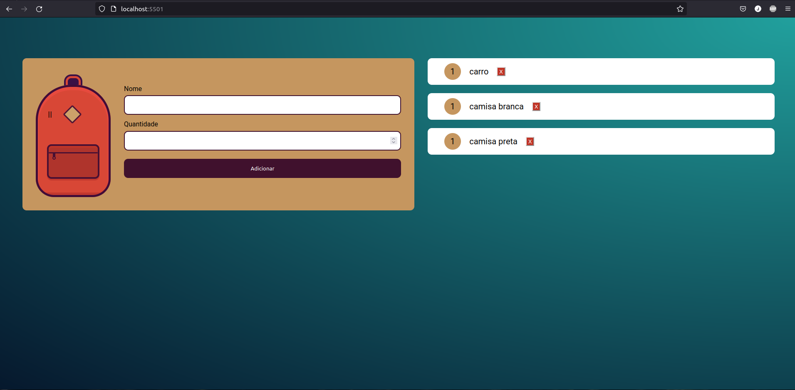

# Treinamento de armazenamento de dados

## Visuzalição da Página

<html>

   
  

    Nesta interface o usuário pode fazer uma lista de coisas para levar em uma viagem, de forma que o navegador está armazenando os dados inseridos a partir do LocalStorage.
  

  

</html>

