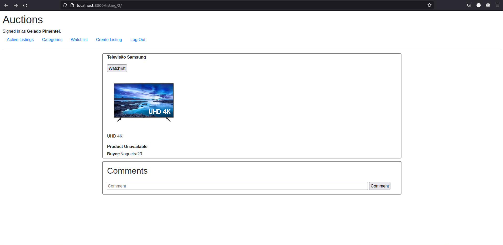

# Web Site E-Commerce

## Ideia

O site foi um projeto de estudo que tinha como principal objetivo a prática da ferramenta Djanfo (framework da linguagem Python).

Obs.: HTML 5, CSS e JavaScript também são utilizados, mas não são o foco principal.

## About

O Web Site foi uma aplicação completa, ou seja, foi implementada uma  autentificação de usuários, armazenamento de dados e suas manipulações, etc.
O site consiste no leião online, de forma que os usuários podem postar produtos para vender, dar lances e fazer comentários.

## Funcionamento

### Primeira Interface
<html>

   
  

    Nesta interface o usuário pode observar todos os produtos que estão sendo vendidos ou foram postados no site.
  

  

</html>

### Segunda Interface
<html>

   
  

    Nesta interface o usuário pode selecionar uma categória como tipo de produto procurado.
  

  

</html>

### Terceira Interface
<html>

   
  

    Nesta interface o usuário pode observar todos os produtos que o mesmo colocou na sua lista de favoritos (Watchlist)
  

  

</html>

### Quarta Interface
<html>

   
  

    Nesta interface o usuário pode interagir com o produto que está sendo leioloado, como dar lance, fazer comentários e ler as opniões de outros usuários.
  

  

</html>

### Quinta Interface
<html>

   
  

    Nesta interface o usuário pode interagir com o produto que está sendo leioloado, como dar lance, fazer comentários e ler as opniões de outros usuários.
  

  
User Não Autenticado: 

  
  
User Autenticado: 

  

</html>

### Sexta Interface
<html>

   
  

    Página de log in
  

  

</html>

### Sétima Interface
<html>

   
  

    Página que o usuário pode se cadastrar no Web Site.
  

  

</html>

